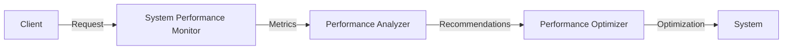

# sysperfmon
A Python-based system performance monitoring and optimization tool.

## Problem Statement
System performance monitoring and optimization are crucial for maintaining efficient and reliable systems. However, manual monitoring and optimization can be time-consuming and prone to errors.

## Why it Matters
Automating system performance monitoring and optimization can greatly reduce manual labor, improve overall system productivity, and reduce downtime.

## Architecture

## Project Structure
```
.
├── README.md
├── CONTRIBUTING.md
├── requirements.txt
├── main.py
├── src
│   ├── core.py
│   ├── monitor.py
│   ├── analyzer.py
│   └── optimizer.py
└── config.json
```
## Installation Steps
1. Clone the repository
2. Install required dependencies using `pip install -r requirements.txt`
3. Configure the tool using `config.json`
## Quick Start
1. Run the tool using `python main.py`
2. View real-time metrics and recommendations
## Configuration
Configure the tool using `config.json`. Refer to the documentation for more information.
## Design Decisions
* Used Python for its simplicity and flexibility
* Implemented a modular structure for easy maintenance and extension
## Roadmap
* Add support for more system metrics
* Integrate with popular monitoring tools
## Contribution
Refer to `CONTRIBUTING.md` for contribution guidelines.
## License
MIT License